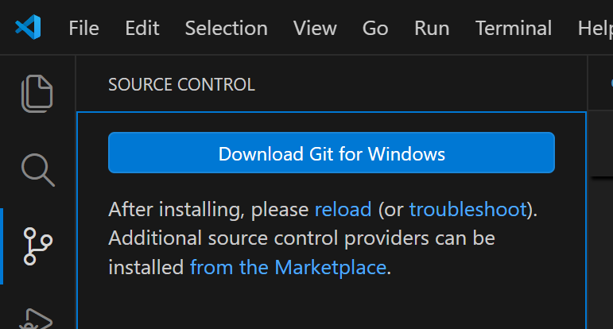

# Git on Visual Studio Code

## Git のインストール
Git をインストールしていない場合、Visual Studio Code の「Source Control」タブは次のように表示されます：

- 「Download Git for Windows」をクリックすると、[Git for Windows](https://git-scm.com/install/windows) が開きます。
- 「the latest x64 version of Git for Windows」をダウンロードしてインストールします。
- インストーラーでは、基本的に既定のオプションを選択します。
  - 次の構成のみ「Use Visual Studio Code as Git’s default editor」を選択します。

## リポジトリのクローン
- Azure Repos のページで、「Clone in VS Code」をクリックします。
- Visual Studio Code が起動します。
- フォルダーを指定すると、その下にクローンが作成されます。
  - リポジトリ名のフォルダーも作成されます。
