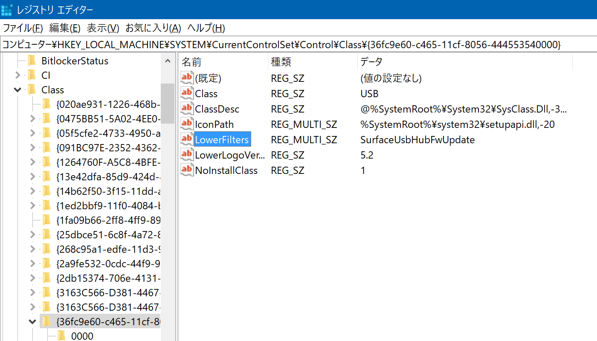
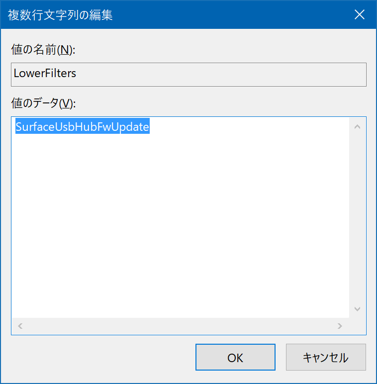
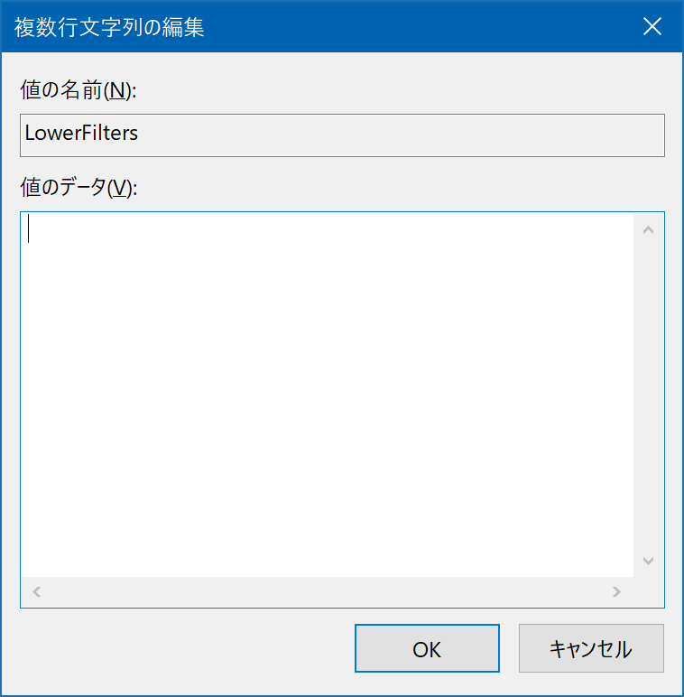
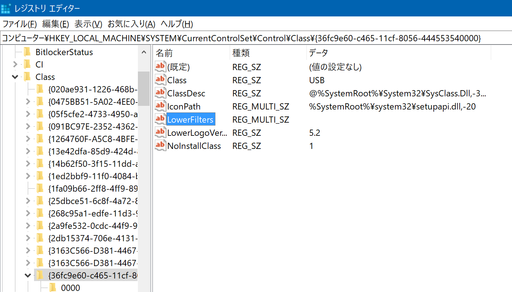

## Surface Book で Kinect v2 が認識されない
ある時の Windows Update 以降、Surface Book に Kinect v2 (Xbox One Kinect センサー) を USB で接続しても認識されなくなりました。

[Kinect Sensor is not recognized on a Surface Book](https://support.microsoft.com/en-us/help/4032123/kinect-sensor-is-not-recognized-on-a-surface-book) によると、「Surface USB Hub Firmware Update driver」の変更が原因であるとしています。

また、この記事には回避策が載っています。以下ではその手順を実行した様子について書いていきます。  
ただし、「問題調査中」とあり、これは一時的な措置のように見えます。

### 手順
`regedit` を実行してレジストリ エディターを起動します。

```
HKEY_LOCAL_MACHINE\SYSTEM\CurrentControlSet\Control\Class\{36fc9e60-c465-11cf-8056-444553540000}
```

に移動します。  


[LowerFilters] をダブルクリックします。値の編集画面が現れます。  
元の値は「SurfaceUsbHubFwUpdate」です。これを削除して空文字列にします。  
  


[OK] をクリックすれば完了です。  


すぐに認識しない場合は、PC を再起動したり Kinect v2 の電源を入れ直せば認識されるはずです。

#### 参照
- [Kinect Sensor is not recognized on a Surface Book](https://support.microsoft.com/en-us/help/4032123/kinect-sensor-is-not-recognized-on-a-surface-book)
