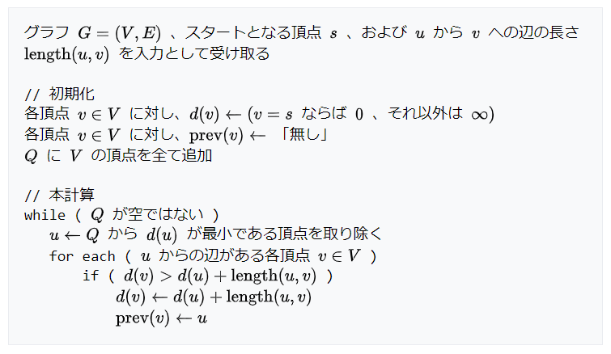

# ダイクストラ法から考える擬似コードの意義
// [競技プログラミング Advent Calendar 2022](https://qiita.com/advent-calendar/2022/kyopro) の 23 日目の記事です。

今回は擬似コードについて書いていきます。  
擬似コードは、アルゴリズムの論文や教科書によく載っている抽象的なコードで、次の特徴があります。

- 理論的に正しい手続き
  - なるべく多くの実装を包含するように、抽象的に書かれる
- データ構造や言語プラットフォームに依存しない
  - 擬似コードに対して、実装コードが 1 通りに決まるとは限らない
  - 大きくは、[抽象データ型](https://ja.wikipedia.org/wiki/%E6%8A%BD%E8%B1%A1%E3%83%87%E3%83%BC%E3%82%BF%E5%9E%8B)と[データ構造](https://ja.wikipedia.org/wiki/%E3%83%87%E3%83%BC%E3%82%BF%E6%A7%8B%E9%80%A0)の違い

科学論文は、その技術がより多くの分野に適用できるようになるべく十分条件を広げ、その結果として抽象的に書かれます。それと同様に、擬似コードはアルゴリズムの本質的な部分を記述している、と言えます。

競技プログラミングの参考書では、擬似コードではなく具体的なプログラミング言語で実装例が書かれていることが多く、それを写経すれば正しく動作するコードが得られるでしょう。  
しかし一般には、アルゴリズムの動作原理を理解したうえでコードに変換するスキルが求められます。また、利用したいデータ構造が各言語プラットフォームの標準ライブラリに存在するとは限らず、要件に合わせたデータ構造の開発が求められることもあります。

例として、[ダイクストラ法 (Dijkstra's algorithm)](https://ja.wikipedia.org/wiki/ダイクストラ法) を見ていきましょう。  
このリンク先の Wikipedia に書かれている説明を一度読んだだけで動作原理や擬似コードを理解し、具体的なコードとして実装するのはだいぶ難しいのではないでしょうか。  
擬似コードは次のように書かれています：

とくに、頂点集合 $Q$ は次のような操作を持つ集合として書かれています (少し意訳)：
- 始点からの距離 $d(u)$ が最小である頂点 $u$ を取得および削除できる
  - 始点からの距離 $d(u)$ が更新されてもこの操作をできる
  - $Q$ の中で順位が動的に変化することに注意

各プログラマーがこれらの抽象的な記述をもとに自力で考えた場合、おそらく具体的な実装方法は分かれるでしょう。  
これまでに筆者が実装しただけでも、次の 3 種類が挙げられます。

#### (1) 優先度付きキュー (更新機能なし)
[実装例 (C#)](https://judge.yosupo.jp/submission/117435)  
優先度付きキューから頂点を取り出したとき、その頂点までの距離が確定済みならばスキップします。このスキップの処理を入れないと、一部のテストケースでは TLE になると思います。  
[プログラミングコンテストチャレンジブック](https://www.amazon.co.jp/dp/B00CY9256C) (通称：蟻本) をはじめ、多くの競技プログラミングの参考書にはこの実装が載っています。

#### (2) 更新機能を持った優先度付きキュー
[実装例 (C#)](https://judge.yosupo.jp/submission/117382)  
二分ヒープを拡張することにより、既に格納されている値を直接更新できます。

#### (3) 平衡二分探索木 (順序付き集合)
[実装例 (C#)](https://judge.yosupo.jp/submission/117381)  
(2) に近い方法ですが、平衡二分探索木を利用する場合は値を直接更新できないため、代わりに古い値を削除して新しい値を追加します。  
.NET 5 以前の C# では標準ライブラリに [PriorityQueue](https://learn.microsoft.com/ja-jp/dotnet/api/system.collections.generic.priorityqueue-2) が存在しないため、[SortedSet](https://learn.microsoft.com/ja-jp/dotnet/api/system.collections.generic.sortedset-1) を利用することで短く書けます。

要するに、ある頂点の情報が確定したらその隣接頂点の情報を動的に更新していくということであり、それを高速に実現できるのであればどの方法でもよいです。実装方法はまだ他にも見つかるかもしれません。

このように、擬似コードはそのアルゴリズムの核心を記述している反面、実際のコードとは見た目が乖離することがあるため注意を要します。脳内で動作原理をなんとなく理解できていることと、それを正確に実装できることは異なるため、テストによる評価も重要でしょう。

なお、上記の実装例のところで [judge.yosupo.jp](https://judge.yosupo.jp/) にある[ダイクストラ法のライブラリチェッカー](https://judge.yosupo.jp/problem/shortest_path)を利用しています。厳しいテストケースが網羅されているようなのでおすすめです。

## 参照
1. [ダイクストラ法 - Wikipedia](https://ja.wikipedia.org/wiki/ダイクストラ法)
1. [Shortest Path (ダイクストラ法のライブラリチェッカー)](https://judge.yosupo.jp/problem/shortest_path)
1. [AlgorithmLab (GitHub)](https://github.com/sakapon/Samples-2020/tree/master/AlgorithmSample/AlgorithmLab/Graphs/SPPs) - 筆者による実装サンプル (C#)

#### 競技プログラミングの参考書
- [プログラミングコンテストチャレンジブック](https://www.amazon.co.jp/dp/B00CY9256C)
- [プログラミングコンテスト攻略のためのアルゴリズムとデータ構造](https://www.amazon.co.jp/dp/B00U5MVXZO)
- [問題解決力を鍛える！アルゴリズムとデータ構造](https://www.amazon.co.jp/dp/B08PV83L3N)
- [アルゴリズム実技検定 公式テキスト［エントリー～中級編］](https://www.amazon.co.jp/dp/B08QRNJ7M3)
- [競技プログラミングの鉄則](https://www.amazon.co.jp/dp/B0BDZGDM9J)
