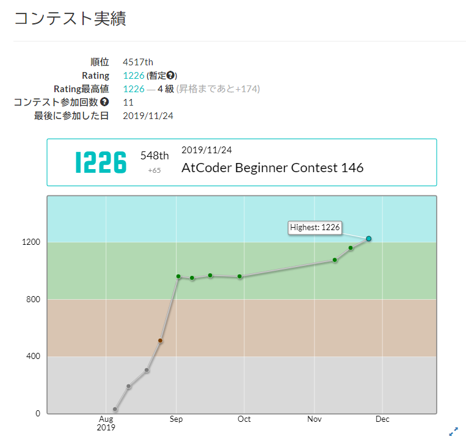
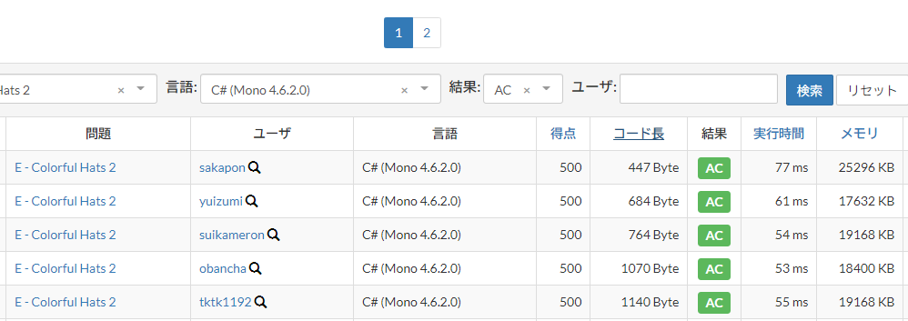

# 競技プログラミングでも C# で簡潔に書きたい
// [Competitive Programming (2) Advent Calendar 2019](https://adventar.org/calendars/4587) の 15 日目の記事です。

競技プログラミングの AtCoder というものを今年の8月に始めて、3～4か月をかけて水色に到達しました。


スピード勝負は得意ではないのですが、難しめの問題を少し時間をかけて解くのが向いているようです。
また、簡潔なコードを書くことを心掛けていて、ショートコード C# 部門があるとしたらだいたい優勝していると思います。
(スペースを切り詰めたりはしません。むしろ Visual Studio で既定のフォーマットをしてから提出しています。)



さて、12月1日に実施された [三井住友信託銀行プログラミングコンテスト2019](https://atcoder.jp/contests/sumitrust2019) では別解が多く見つかり、考察を楽しめる問題セットでした。
全体的にだいぶ簡潔に書ける回だったので、その中から問題 B, C, D を解説してみたいと思います。

## [B - Tax Rate](https://atcoder.jp/contests/sumitrust2019/tasks/sumitb2019_b)

```
税込価格で N 円となるときの税抜価格はいくらか。
```

小数を考慮しなければならないため、第一感ではどんな値が適合するのかもやっとしますが、そんなときは 1 から N までの全探索でも正解できます。

https://gist.github.com/sakapon/89962e9dc7bda4a4264d9552f04bb394

しっかり考察してみると、税抜価格が1以上離れれば税込価格も1以上離れることから税抜価格と税込価格は1対1に対応し、税込価格 N に対する税抜価格はたかだか1個存在することがわかります。
また、1.08X ≥ N つまり X ≥ N / 1.08 であることから、X の候補は N / 1.08 の天井 (ceiling) に限られます。
(これより 1 以上大きい整数の税込価格は N+1 以上になってしまう。)
あとはこれの税込価格が実際に N に一致するかどうかを確かめれば OK です。

https://gist.github.com/sakapon/1b0cc3ec9b9f5efd3c66afda6d7ac750

### 他に投稿した記事
- [AtCoder を始めようかと思っている学生たちへ](https://blog.kcg.ne.jp/futurelab/2019/10/04/atcoder/)
- [11月祭で「利きコード選手権」を開催しました (その1)](https://blog.kcg.ne.jp/futurelab/2019/11/18/kikicode/)
