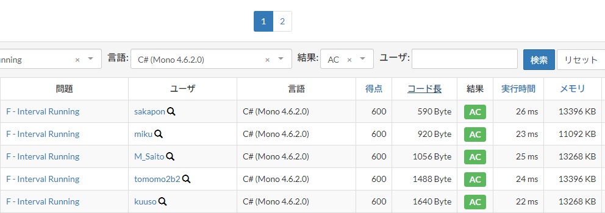

# 競技プログラミングでも C# で簡潔に書きたい
// [Competitive Programming (2) Advent Calendar 2019](https://adventar.org/calendars/4587) の 15 日目の記事です。

競技プログラミングの AtCoder というものを今年の8月に始めて、3～4か月をかけて水色に到達しました。


スピード勝負は得意ではないのですが、難しめの問題を少し時間をかけて解くのが向いているようです。
また、簡潔なコードを書くことを心掛けていて、ショートコード C# 部門があるとしたらだいたい優勝していると思います。  
(スペースを切り詰めたりはしません。むしろ Visual Studio で既定のフォーマットをしてから提出しています。)



さて、12月1日に実施された [三井住友信託銀行プログラミングコンテスト2019](https://atcoder.jp/contests/sumitrust2019) では、別解が多くあり考察を楽しめる問題セットでした。
全体的にだいぶ簡潔に書ける回だったので、その中から問題 B, C, D を解説してみたいと思います。

## [B - Tax Rate](https://atcoder.jp/contests/sumitrust2019/tasks/sumitb2019_b)

```
税込価格で N 円となるときの税抜価格はいくらか。
```

小数を考慮しなければならないため、第一感ではどんな値が適合するのかもやっとしますが、そんなときは 1 から N までの全探索でも正解できます。

https://gist.github.com/sakapon/89962e9dc7bda4a4264d9552f04bb394

しっかり考察してみると、税抜価格が1離れれば税込価格も1以上離れることから税抜価格と税込価格は1対1に対応し、税込価格 N に対する税抜価格はたかだか1個存在することがわかります。
また、 `1.08X ≥ N` つまり `X ≥ N / 1.08` であることから、X の候補は `N / 1.08` の天井 (ceiling) に限られます。
(これより 1 以上大きい整数の税込価格は N+1 以上になってしまう。)
あとはこれの税込価格が実際に N に一致するかどうかを確かめれば OK です。

https://gist.github.com/sakapon/1b0cc3ec9b9f5efd3c66afda6d7ac750

## [C - 100 to 105](https://atcoder.jp/contests/sumitrust2019/tasks/sumitb2019_c)

```
合計価格がちょうど X 円となるような買い物ができるか。
```

商品の価格の差が1円単位なので、商品の個数が N のとき、合計価格の候補は `100N ≤ X ≤ 105N` の範囲の整数値となります。
そこでこの問題も、やはり安全策の全探索で通ります。

https://gist.github.com/sakapon/c0772ce205f52dfd92c5d8d2713395e2

今度もまたしっかり考察してみます。
商品の個数 N が `[X / 100]` より大きい場合は、合計価格は X を超えてしまいます。
また、N が `[X / 100]` より小さい場合に `100N ≤ X ≤ 105N` を満たしているとすると、N+1 もこれを満たしているはずです。
したがって `N = [X / 100]` の場合のみを調べればよく、次のようなコードで書けます。

https://gist.github.com/sakapon/00cbe06f702eb000234ac44c9c28480d

## [D - Lucky PIN](https://atcoder.jp/contests/sumitrust2019/tasks/sumitb2019_d)

```
文字列 S から3文字を取り出してその順に並べたものは何種類あるか。
```

https://gist.github.com/sakapon/a85348186a8f49dc01980b83b4731d93

まず前処理として、どの文字がどのインデックスに現れるかを取得できるように辞書を作っておきます。
この辞書のキーはたかだか10種類です。
そして1文字目から順に、選択可能なインデックスの範囲から文字を選択していきます。

まず1文字目では、その文字が最初に現れるインデックスを選ぶのが最適です。
2文字目では、1文字目のインデックスより大きいインデックスのうち最小のものを選ぶのが最適です。
あとは、3文字目の最後のインデックスが2文字目のインデックスより大きければ成立します。
foreach を使ってカウントしていくコードを書くと次のようになります。


foreach の入れ子構造を SelectMany メソッドを使って平坦化 (flatten) する方法もあるのですが、今回は C# のクエリ式を使ってみます。クエリ式は普段はそれほど使わないのですが、このようにコレクションのコレクションを平坦化するときは強力だと思います。

https://gist.github.com/sakapon/ee5d8b247c56e101ab931ab3d2899d04

だいぶ見やすくなりました。

ちなみに処理量は、1文字目が10、2文字目が N (たかだか N 文字しかない)、3文字目が10のため、全体で O(100・N) です。  
また、2文字目のインデックスを探索するところを二分探索にすれば O(1000・logN) となります。ただし、前処理に少なくとも O(N) かかるためそちらのほうが影響するかもしれません。

### 他に投稿した記事
- [AtCoder を始めようかと思っている学生たちへ](https://blog.kcg.ne.jp/futurelab/2019/10/04/atcoder/)
- [11月祭で「利きコード選手権」を開催しました (その1)](https://blog.kcg.ne.jp/futurelab/2019/11/18/kikicode/)
