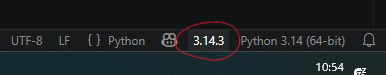
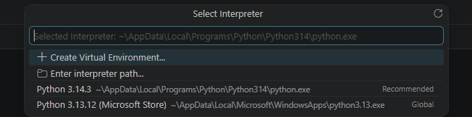
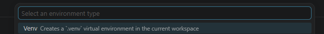
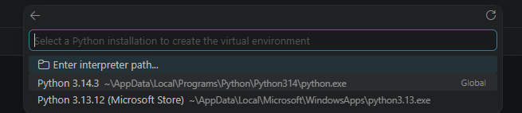
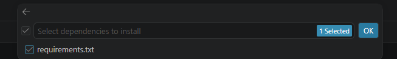

# Python セットアップ

### Python
https://www.python.org/downloads/
- `Add python.exe to PATH` をチェックしてからインストールを開始する
- Python 3.13 以前は Microsoft Store でもインストール可能
- Python 3.14 の Python Install Manager は不明

### ワークスペース
- ルート フォルダーに、ワークスペース ファイルおよびソース フォルダーを置く

### Visual Studio Code
- 拡張機能
  - Python
- venv
  - 右下の `Select interpreter` (または `3.13`) をクリック
  - 上で `Create virtual environment` をクリック
  - `Venv` を選択
  - 使用する python.exe を選択
  - requirements.txt を選択







### venv で実行する
そのままでは venv では実行できない  
1回のみ、PowerShell を管理者権限で起動し、次を実行する
- `Set-ExecutionPolicy RemoteSigned`

```
.\.venv\Scripts\activate.bat
pip install -r requirements.txt
pip install xyz.whl (Rust)
```
