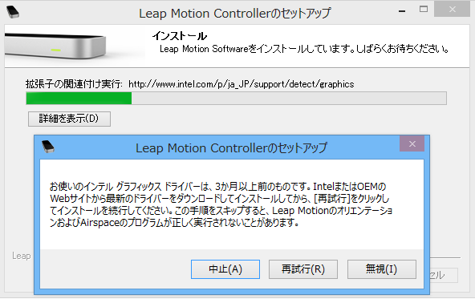
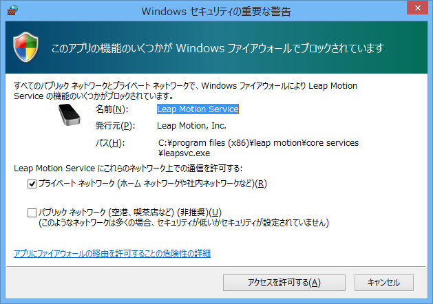

## セットアップ

### インストール時のダイアログ
1. Surface Pro (Windows 8) の場合、警告が表示される。[無視] をクリックする。
  
1. ファイアウォールへのアクセスを許可する。
  

### .NET で Leap SDK を使う
#### .NET の DLL を参照する
* (SDK を展開したフォルダー)\LeapDeveloperKit\LeapSDK\lib\LeapCSharp.NET4.0.dll

#### ネイティブの DLL を実行フォルダーにコピーする
* (SDK を展開したフォルダー)\LeapDeveloperKit\LeapSDK\lib\x86\Leap.dll
* (SDK を展開したフォルダー)\LeapDeveloperKit\LeapSDK\lib\x86\LeapCSharp.dll
